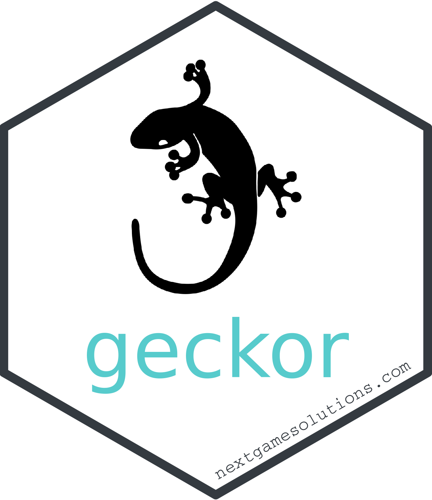

<!-- README.md is generated from README.xcvRmd. Please edit that file -->

```{r, include = FALSE, message=FALSE}
knitr::opts_chunk$set(
  collapse = TRUE,
  comment = "#>",
  fig.path = "man/figures/README-",
  out.width = "100%"
)
```

# geckor 

<!-- badges: start -->

[](https://github.com/next-game-solutions/geckor/actions) [](https://codecov.io/gh/next-game-solutions/geckor?branch=main) [](https://lifecycle.r-lib.org/articles/stages.html#stable) [](https://cran.r-project.org/package=geckor)

<!-- badges: end -->

`geckor` is an R client for the _free_ version of the [CoinGecko API](https://www.coingecko.com/en/api#explore-api). This package implements several endpoints offered by that API, allowing users to collect the current and historical market data on thousands of cryptocurrencies from hundreds of exchanges. Results are returned in a tabular form (as [tibbles](https://tibble.tidyverse.org/)), ready for any downstream analyses.

## Installation

A stable version of the package can be installed from [CRAN](https://CRAN.R-project.org/package=geckor) the usual way:

``` r
install.packages("geckor")
```

To install the development version from GitHub, use the following command(s):

``` r
# install.packages("devtools")
devtools::install_github("next-game-solutions/geckor")
```

## Examples

Detailed examples of how to use `geckor` can be found in its [online documentation](https://next-game-solutions.github.io/geckor/). Provided below are just a few common queries:

```{r load-geckor}
library(geckor)

# check if the CoinGecko service is available (this command can be
# particularly useful to check if the API rate limit has been exceeded):
ping()
```

```{r example, message=FALSE, fig.align='center', fig.width=10, fig.height=4.5}
library(dplyr)
library(ggplot2)

# Get the current price of Cardano, Tron, and Polkadot,
# expressed in USD, EUR, and GBP:
current_price(
  coin_ids = c("cardano", "tron", "polkadot"),
  vs_currencies = c("usd", "eur", "gbp")
)

# Get a more comprehensive view of the current Cardano, Tron, and
# Polkadot markets:
current_market(
  coin_ids = c("cardano", "tron", "polkadot"),
  vs_currency = "usd"
) %>%
  glimpse()

# Collect all historical data on the price of Cardano (expressed in EUR),
# and plot the result:
cardano_history <- coin_history(
  coin_id = "cardano",
  vs_currency = "eur",
  days = "max"
)

cardano_history %>%
  ggplot(aes(timestamp, price)) +
  geom_line() +
  theme_minimal()

# Here we are querying the history of two coins simultaneously:
# "cardano" and "polkadot":
two_coins <- coin_history(
  coin_id = c("cardano", "polkadot"),
  vs_currency = "usd",
  days = 3
)
two_coins$coin_id %>% unique()
```

> NOTE: As of v0.2.0, all `coin_history_*()` functions could retrieve data for up 30 coins in one call. However, this number had to be scaled down to 5 in the current version, v0.3.0, due to the significantly lower API rate limit imposed by CoinGecko.


## API rate limit

When this package was first released back in 2021, the free version of the 
[CoinGecko API](https://www.coingecko.com/api/documentations/v3) offered a rate
limit of ca. 50 calls/minute. Unfortunately, since then CoinGecko has 
reduced that rate dramatically in a push to commercialise their product. As of
March 2023, a realistic rate limit was around 10-15 calls/minute, making it
rather hard to use the free API (and, therefore, `geckor`) for any serious workloads. Please keep this in mind when developing your applications using the `geckor` package.

## Getting help

If you encounter a clear bug, please file an issue with a minimal reproducible example on [GitHub](https://github.com/next-game-solutions/geckor/issues).

## Licensing

This package is licensed to you under the terms of the MIT License.

The gecko silhouette image used in the hexagon logo of this package has been downloaded from [Clipartkey.com](https://www.clipartkey.com/view/hmTimm_geckos-png-transparent-gecko-icon-transparent/) and is believed to be in the public domain. The logo has been created using the [hexmake app](https://connect.thinkr.fr/hexmake/).

Copyright © `r substr(as.Date(Sys.Date()), 1, 4)` [Next Game Solutions OÜ](http://nextgamesolutions.com)

------------------------------------------------------------------------

Please note that this project is released with a [Contributor Code of Conduct](https://www.contributor-covenant.org/version/1/0/0/code-of-conduct/). By participating in this project you agree to abide by its terms.
