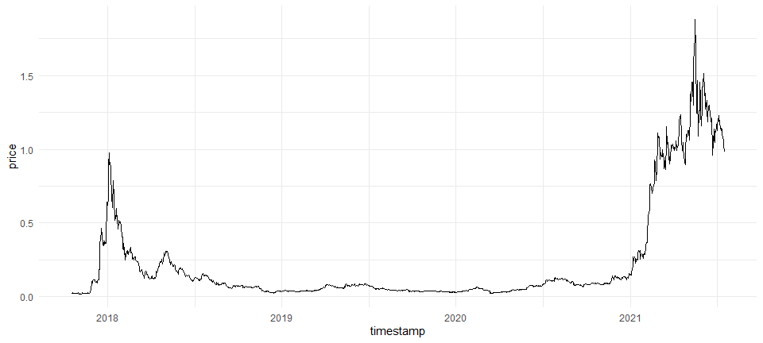

<!-- README.md is generated from README.Rmd. Please edit that file -->

# geckor <a href="https://next-game-solutions.github.io/geckor/"></a>

<!-- badges: start -->

[](https://github.com/next-game-solutions/geckor/actions)
[](https://cran.r-project.org/package=geckor)
[](https://codecov.io/gh/next-game-solutions/geckor?branch=main)
[](https://lifecycle.r-lib.org/articles/stages.html#stable)
[](https://cran.r-project.org/package=geckor)

<!-- badges: end -->

`geckor` is an R client for the *free* version of the [CoinGecko
API](https://www.coingecko.com/en/api#explore-api). This package
implements several endpoints offered by that API, allowing users to
collect the current and historical market data on thousands of
cryptocurrencies from hundreds of exchanges. Results are returned in a
tabular form (as [tibbles](https://tibble.tidyverse.org/)), ready for
any downstream analyses.

## Installation

A stable version of the package can be installed from
[CRAN](https://CRAN.R-project.org/package=geckor) the usual way:

``` r
install.packages("geckor")
```

To install the development version from GitHub, use the following
command(s):

``` r
# install.packages("devtools")
devtools::install_github("next-game-solutions/geckor")
```

## Examples

Detailed examples of how to use `geckor` can be found in its [online
documentation](https://next-game-solutions.github.io/geckor/). Provided
below are just a few common queries:

``` r
library(geckor)
#> R client for the CoinGecko API
#> Developed by Next Game Solutions (http://nextgamesolutions.com)

# check if the CoinGecko service is available (this command can be
# particularly useful to check if the API rate limit has been exceeded):
ping()
#> [1] TRUE
```

``` r
library(dplyr)
library(ggplot2)

# Get the current price of Cardano, Tron, and Polkadot,
# expressed in USD, EUR, and GBP:
current_price(
  coin_ids = c("cardano", "tron", "polkadot"),
  vs_currencies = c("usd", "eur", "gbp")
)
#> # A tibble: 9 × 7
#>   coin_id   price vs_currency   market_cap   vol_24h price…¹ last_updated_at    
#>   <chr>     <dbl> <chr>              <dbl>     <dbl>   <dbl> <dttm>             
#> 1 cardano  0.361  usd         12689075561.    3.15e8   5.17  2023-03-28 19:23:43
#> 2 cardano  0.333  eur         11699962121.    2.90e8   4.72  2023-03-28 19:23:43
#> 3 cardano  0.293  gbp         10284203893.    2.55e8   4.72  2023-03-28 19:23:43
#> 4 polkadot 6.06   usd          7371780769.    1.51e8   3.10  2023-03-28 19:23:40
#> 5 polkadot 5.59   eur          6797150458.    1.40e8   2.64  2023-03-28 19:23:40
#> 6 polkadot 4.91   gbp          5974658763.    1.23e8   2.66  2023-03-28 19:23:40
#> 7 tron     0.0641 usd          5851571758.    3.52e8   0.874 2023-03-28 19:23:36
#> 8 tron     0.0591 eur          5396319475.    3.24e8   0.425 2023-03-28 19:23:36
#> 9 tron     0.0520 gbp          4741938206.    2.85e8   0.448 2023-03-28 19:23:36
#> # … with abbreviated variable name ¹​price_percent_change_24h

# Get a more comprehensive view of the current Cardano, Tron, and
# Polkadot markets:
current_market(
  coin_ids = c("cardano", "tron", "polkadot"),
  vs_currency = "usd"
) %>%
  glimpse()
#> Rows: 3
#> Columns: 32
#> $ coin_id                                  <chr> "cardano", "polkadot", "tron"
#> $ symbol                                   <chr> "ada", "dot", "trx"
#> $ name                                     <chr> "Cardano", "Polkadot", "TRON"
#> $ vs_currency                              <chr> "usd", "usd", "usd"
#> $ last_updated_at                          <dttm> 2023-03-28 19:23:43, 2023-03-…
#> $ current_price                            <dbl> 0.361329, 6.060000, 0.064135
#> $ market_cap                               <dbl> 12689075561, 7371780769, 5851…
#> $ market_cap_rank                          <int> 7, 13, 16
#> $ fully_diluted_valuation                  <dbl> 16293567152, 7862074556, 5851…
#> $ total_volume                             <int> 314844487, 151291225, 3516209…
#> $ high_24h                                 <dbl> 0.362596, 6.060000, 0.064538
#> $ low_24h                                  <dbl> 0.340777, 5.810000, 0.063214
#> $ price_change_24h                         <dbl> 0.01777009, 0.18186900, 0.00…
#> $ price_change_percentage_24h              <dbl> 5.17235, 3.09588, 0.87356
#> $ market_cap_change_24h                    <int> 649457410, 226364606, 58443269
#> $ market_cap_change_percentage_24h         <dbl> 5.39434, 3.16797, 1.00884
#> $ circulating_supply                       <dbl> 35045020830, 1216721335, 9106…
#> $ total_supply                             <dbl> 45000000000, 1297644918, 9106…
#> $ max_supply                               <dbl> 4.5e+10, NA, NA
#> $ ath                                      <dbl> 3.090000, 54.980000, 0.231673
#> $ ath_change_percentage                    <dbl> -88.27058, -88.97655, -72.260…
#> $ ath_date                                 <dttm> 2021-09-02 06:00:10, 2021-11-…
#> $ atl                                      <dbl> 0.01925275, 2.70000000, 0.001…
#> $ atl_change_percentage                    <dbl> 1780.6496, 124.6856, 3461.6535
#> $ atl_date                                 <dttm> 2020-03-13 02:22:55, 2020-08-…
#> $ price_change_percentage_1h_in_currency   <dbl> 0.9341879, 1.8463548, 0.14733…
#> $ price_change_percentage_24h_in_currency  <dbl> 5.1723483, 3.0958767, 0.87355…
#> $ price_change_percentage_7d_in_currency   <dbl> 7.964421, -1.040912, -2.327616
#> $ price_change_percentage_14d_in_currency  <dbl> 5.0559277, -0.7807645, -4.477…
#> $ price_change_percentage_30d_in_currency  <dbl> -0.3644916, -7.3714292, -5.62…
#> $ price_change_percentage_200d_in_currency <dbl> -24.728783, -18.104854, 4.645…
#> $ price_change_percentage_1y_in_currency   <dbl> -69.35711, -72.94615, -6.99422

# Collect all historical data on the price of Cardano (expressed in EUR),
# and plot the result:
cardano_history <- coin_history(
  coin_id = "cardano",
  vs_currency = "eur",
  days = "max"
)

cardano_history %>%
  ggplot(aes(timestamp, price)) +
  geom_line() +
  theme_minimal()
```



``` r

# Here we are querying the history of two coins simultaneously:
# "cardano" and "polkadot":
two_coins <- coin_history(
  coin_id = c("cardano", "polkadot"),
  vs_currency = "usd",
  days = 3
)
two_coins$coin_id %>% unique()
#> [1] "cardano"  "polkadot"
```

> NOTE: As of v0.2.0, all `coin_history_*()` functions could retrieve
> data for up 30 coins in one call. However, this number had to be
> scaled down to 5 in the current version, v0.3.0, due to the
> significantly lower API rate limit imposed by CoinGecko.

## API rate limit

When this package was first released back in 2021, the free version of
the [CoinGecko API](https://www.coingecko.com/api/documentations/v3)
offered a rate limit of ca. 50 calls/minute. Unfortunately, since then
CoinGecko has reduced that rate dramatically in a push to commercialise
their product. As of March 2023, a realistic rate limit was around 10-15
calls/minute, making it rather hard to use the free API (and, therefore,
`geckor`) for any serious workloads. Please keep this in mind when
developing your applications using the `geckor` package.

## Getting help

If you encounter a clear bug, please file an issue with a minimal
reproducible example on
[GitHub](https://github.com/next-game-solutions/geckor/issues).

## Licensing

This package is licensed to you under the terms of the MIT License.

The gecko silhouette image used in the hexagon logo of this package has
been downloaded from
[Clipartkey.com](https://www.clipartkey.com/view/hmTimm_geckos-png-transparent-gecko-icon-transparent/)
and is believed to be in the public domain. The logo has been created
using the [hexmake app](https://connect.thinkr.fr/hexmake/).

Copyright © 2023 [Next Game Solutions OÜ](http://nextgamesolutions.com)

------------------------------------------------------------------------

Please note that this project is released with a [Contributor Code of
Conduct](https://www.contributor-covenant.org/version/1/0/0/code-of-conduct/).
By participating in this project you agree to abide by its terms.
